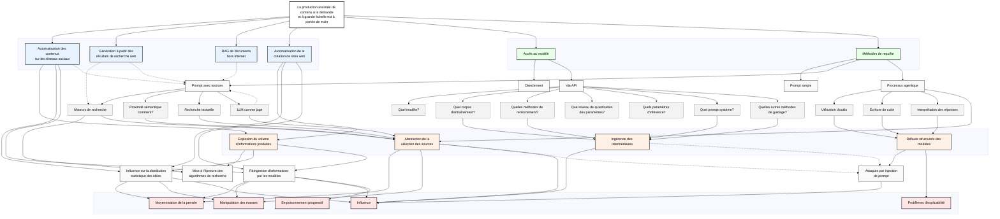

# mindmap
mindmap production artificielle

```mermaid
%%{init: {'theme': 'base', 'themeVariables': { 'backgroundColor': '#ffffff' }}}%%
graph TB     
    A["La production assistée de contenu à la demande<br>et à grande échelle est à portée de main"]        
    
    %% Illustrations
    B1["Automatisation des contenus<br>sur les réseaux sociaux"]    
    B2["Génération à partir des<br>résultats de recherche web"]    
    B3["RAG de documents<br>hors internet"]
    B4["Automatisation de la<br>création de sites web"]        
    
    %% Moyens Techniques
    C1[Accès au modèle]    
    C1a["Directement"]    
    C1b["Via API"]    
    C1b1["Quel modèle?"]    
    C1b2["Quel corpus d'entraînement?"]    
    C1b3["Quelles méthodes de renforcement?"]    
    C1b4["Quel niveau de quantization<br>des paramètres?"]    
    C1b5["Quels paramètres d'inférence?"]    
    C1b6["Quel prompt système?"]    
    C1b7["Quelles autres méthodes de guidage?"]        
    
    C2[Méthodes de requête]    
    C2a["Prompt simple"]    
    C2b["Prompt avec sources"]    
    C2c["Processus agentique"]    
    C2b1["Moteurs de recherche"]
    C2b2["Proximité sémantique<br>comment?"] 
    C2b3["Recherche textuelle"] 
    C2b4["LLM comme juge"]           
    C2c1["Utilisation d'outils"]    
    C2c2["Écriture de code"]    
    C2c3["Interprétation des réponses"]        
    
    %% Conséquences
    D1["Explosion du volume<br>d'informations produites"]    
    D1a["Mise à l'épreuve des<br>algorithmes de recherche"]    
    D1b["Influence sur la distribution<br>statistique des idées"]    
    D1c["Réingestion d'informations<br>par les modèles"]    
    D2["Abstraction de la<br>sélection des sources"]    
    D3["Ingérence des intermédiaires"]    
    D4["Défauts structurels des modèles"]    
    D4a["Attaques par injection<br>de prompt"]        
    
    %% Risques
    E1["Moyennisation de la pensée"]    
    E2["Manipulation des masses"]    
    E3["Empoisonnement progressif"]    
    E4["Influence"]    
    E5["Problèmes d'explicabilité"]        
    
    %% Liens    
    A --> B1 & B2 & B3 & B4 & C1 & C2     
    C1 --> C1a & C1b
    C1b --> C1b1 & C1b2 & C1b3 & C1b4 & C1b5 & C1b6 & C1b7
    C2 --> C2a & C2b & C2c     
    C2b --> C2b1 & C2b2 & C2b3 & C2b4    
    C2c --> C2c1 & C2c2 & C2c3     
    B1 & B4 --> D1 & D1b & D1c 
    C2b1 --> D1a 
    C1b2 & C1b3 & C1b6 & C1b7 --> D3
    C2b1 & C2c & C2b2 & C2b3 & C2b4 --> D2
    D1 --> D1a & D1b & D1c     
    D4 --> D4a     
    C2c1 & C2c2 & C2c3 --> D4
    D1b & D1c & D2 --> E1 & E2 & E4
    D1c --> E3
    D3 & D4a --> E4
    D4 --> E5          
    
    %% Liens entre Illustrations et Moyens Techniques     
    B2 -.-> C2b1     
    B1 & B2 & B3 -.-> C2b
    C2b4 -.-> C2b
    D3 & D2 -.->  D4a        
    
    %% Style    
    classDef default fill:#ffffff,stroke:#000000,stroke-width:1px,color:#000000;    
    classDef root fill:#ffffff,stroke:#000000,stroke-width:2px,color:#000000;    
    classDef illustrations fill:#e6f3ff,stroke:#000000,stroke-width:1.5px,color:#000000;
    classDef moyens fill:#e6ffe6,stroke:#000000,stroke-width:1.5px,color:#000000;
    classDef consequences fill:#fff0e6,stroke:#000000,stroke-width:1.5px,color:#000000; 
    classDef risques fill:#ffe6e6,stroke:#000000,stroke-width:1.5px,color:#000000;      
    classDef subsection fill:#f9f9f9,stroke:#000000,stroke-width:1px,color:#000000;    
    classDef subsubsection fill:#f3f3f3,stroke:#000000,stroke-width:0.5px,color:#000000;    
    class A root;    
    class B1,B2,B3,B4 illustrations;
    class C1,C2 moyens; 
    class D1,D2,D3,D4 consequences;  
    class E1,E2,E3,E4,E5 risques; 
    class C1a,C1b,C2a,C2b,C2c,D1a,D1b,D1c,D4a subsection;    
    class C1b1,C1b2,C1b3,C1b4,C1b5,C1b6,C1b7,C2b1,C2b2,C2b3,C2b4,C2c1,C2c2,C2c3 subsubsection;

    %% Subgraph for more vertical layout
    subgraph SG1 [" "]
        B1
        B2
        B3
        B4
    end
    subgraph SG2 [" "]
        C1
        C2
    end
    subgraph SG3 [" "]
        D1
        D2
        D3
        D4
    end
    subgraph SG4 [" "]
        E1
        E2
        E3
        E4
        E5
    end
```
